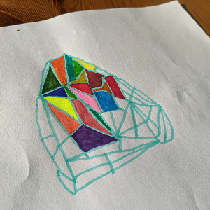
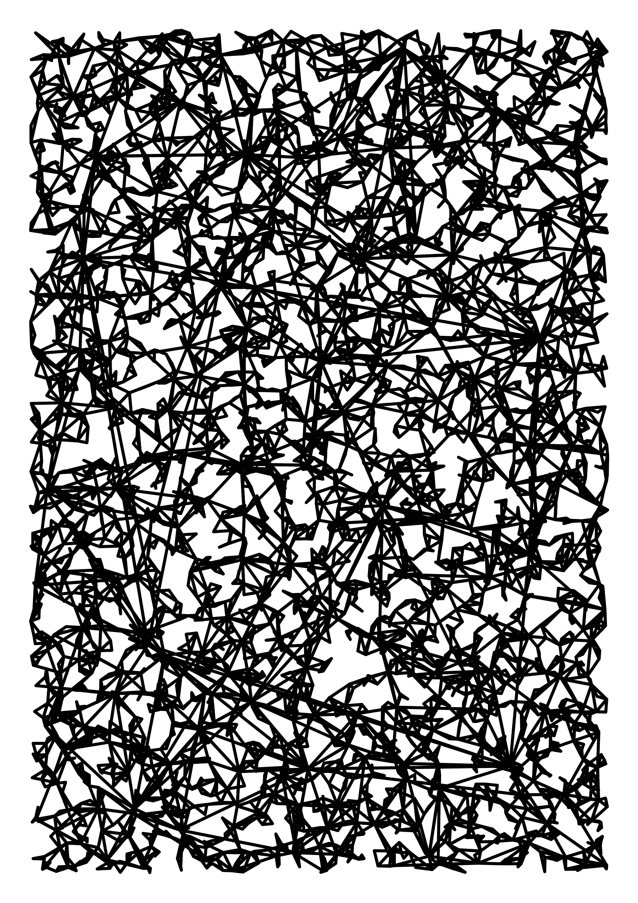
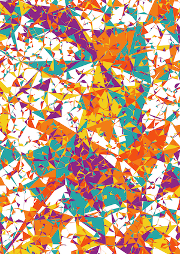
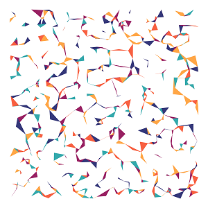
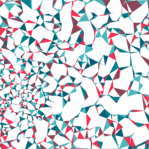
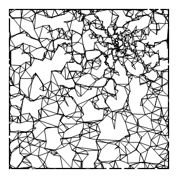
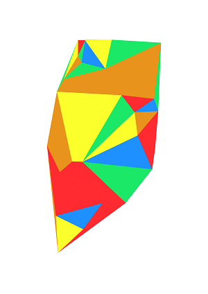
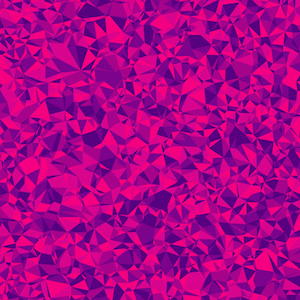
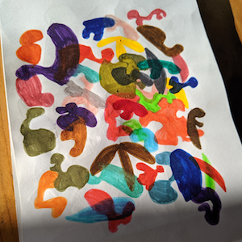

# cnvs-lcs

Generatives from Lucas drawing



## Methods

I've tried several methods to get there, but as the results where interesting I kept them.

### #1 Add vertex and draw triangle with closest vertices

 

```javascript
LcsCnvs.drawTriangleAfterNewVertex(settings);
```

### #2 Add all vertices and then for each vertex draw triangle with closest vertices



```javascript
LcsCnvs.drawTriangleForEachVertex(settings);
```

### #3 Add vertex close to vertices zone and draw triangle with closest vertices

 

```javascript
LcsCnvs.drawTriangleAround(settings);
```

### Delaunay !

Since I couldn't find a way to get there I did research and find out [Delaunay triangulation](https://en.wikipedia.org/wiki/Delaunay_triangulation) and then [this script](https://github.com/ironwallaby/delaunay).

 

```javascript
LcsCnvs.drawDelaunay(settings);
```

## Settings

Here is a basic setting:

```javascript
{
  canvas: { //canvas settings
    width: 2100,
    height: 2970,
    padding: 100 //padding can be negative
  },
  color: {
    fill: "#ffffff", //background color
    stroke: { //line color
      "0": "#ff0000", //if color is an Object, it will be a gradient
      "0.5": "#00ff00",
      "1": "#0000ff" //from 0 to 1
    }
  },
  line: {
    width: 10, //0 to remove border
    cap: "square",
    join: "round"
  },
  vertex: {
    nb: 25, //number of vertex
    color: ["#1F90FF", "#1CE867", "#FBFF2C", "#E8941C", "#FF2B31"] //if color is an Array, a color will be randomly used
  }
}
```

By changing those settings, outputs can be very differents.

## Next

No jealous, I have to take a look at the drawing of the brother...


