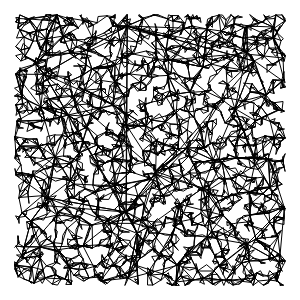
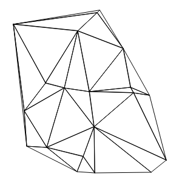
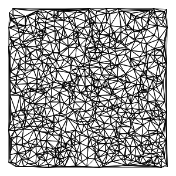

# cnvs-lcs


At first, the idea was to generate something close to Lucas's drawing.  
I've tried several approaches to get there, but as the results where interesting I kept them.

## Approaches

### #1 Add vertex and draw triangle with closest vertices

| 20 vertices                 | 2000 vertices               |
| --------------------------- | --------------------------- |
|  |  |

If we get lucky it can look similar, but I really like the effect when there is a lot of vertices.

### #2 Add all vertices and then for each vertex draw triangle with closest vertices

| 20 vertices                 | 2000 vertices               |
| --------------------------- | --------------------------- |
|  |  |

Nope.

### #3 Add vertex close to vertices zone and draw triangle with closest vertices

| 20 vertices                 | 2000 vertices               |
| --------------------------- | --------------------------- |
|  |  |

Same here, if we're lucky we can get something close.

### Delaunay!

| 20 vertices                 | 2000 vertices               |
| --------------------------- | --------------------------- |
|  |  |

Since I couldn't find a way to get there I did research and find out [Delaunay triangulation](https://en.wikipedia.org/wiki/Delaunay_triangulation) and then [this script](https://github.com/ironwallaby/delaunay).

Even if Lucas's drawing wasn't only based on triangles, this is really what I tried to get. **And I have its validation ;)**

## API

### Init

First, we need to set a canvas:

#### .setCanvas(settings)

```javascript
const canvasSettings = {
  width: 2100,
  height: 2970,
  padding: 100, // padding can be negative
  fill: "#ffffff" // background color
};

const mySheet = new LcsCnvs();
mySheet.setCanvas(canvasSettings);
```

### Draw

And now we can draw:

#### .drawTriangleAfterNewVertex(settings)

```javascript
mySheet.drawTriangleAfterNewVertex(polygonSettings);
```

#### .drawTriangleForEachVertex(settings)

```javascript
mySheet.drawTriangleForEachVertex(polygonSettings);
```

#### .drawTriangleAround(settings)

```javascript
mySheet.drawTriangleAround(polygonSettings);
```

#### .drawDelaunay(settings)

```javascript
mySheet.drawDelaunay(polygonSettings);
```

##### Settings

By changing the polygon settings, outputs can be very differents.

Here is a polygon setting example:

```javascript
{
  color: ["#1F90FF", "#1CE867", "#FBFF2C", "#E8941C", "#FF2B31"] // if color is an Array, a color will be randomly used
  blendingMode: "multiply",
  line: {
    color: {
      // line color
      "0": "#ff0000", // if color is an Object, it will be a gradient
      "0.5": "#00ff00",
      "1": "#0000ff" // from 0 to 1
    },
    width: 5, // 0 to remove border
    cap: "square",
    join: "round"
  },
  vertex: {
    nb: 12000, // number of vertex
    distance: 5, // maximum vertex distance from vertice area (only used for the drawTriangleAround method)
    onPixel: true // used if you don't wan't vertex on loaded image, need a transparent background
  }
}
```

### Display

And then, display result:

#### .append(querySelector)

```javascript
mySheet.append("body");
```

| #1                          | #2                          | #3                          | #4                          |
| --------------------------- | --------------------------- | --------------------------- | --------------------------- |
|  |  |  |  |

### Extra

Because _I had to_ use those generative for [Daron Crew](https://www.instagram.com/daroncrew) artworks, I added this extra method:

#### .addImage(settings)

```javascript
const imageSettings = {
  src: "./img/daron-crew.svg", // path to image
  width: 1520 // desired width (height is calculated)
};

mySheet.addImage(imageSettings).then(sheet => {
  sheet.append("body");
});
```

**The image will be vertically and horizontally centered.**

There is also a dedicated polygon parameter: `onPixel`.
If defined, it will condition if vertex must be positionned on used pixel (`true`) or not (`false`).
**Must be used on a canvas without background.**

| onPixel: undefined            | onPixel: false                          | onPixel: true                           |
| ----------------------------- | --------------------------------------- | --------------------------------------- |
|  |  |  |

## Example

[Here some code examples](docs/js) and [here a demo](https://smndhm.github.io/lcs-cnvs/).

## next

No jealous, I have to take a look at the drawing of the brother...


